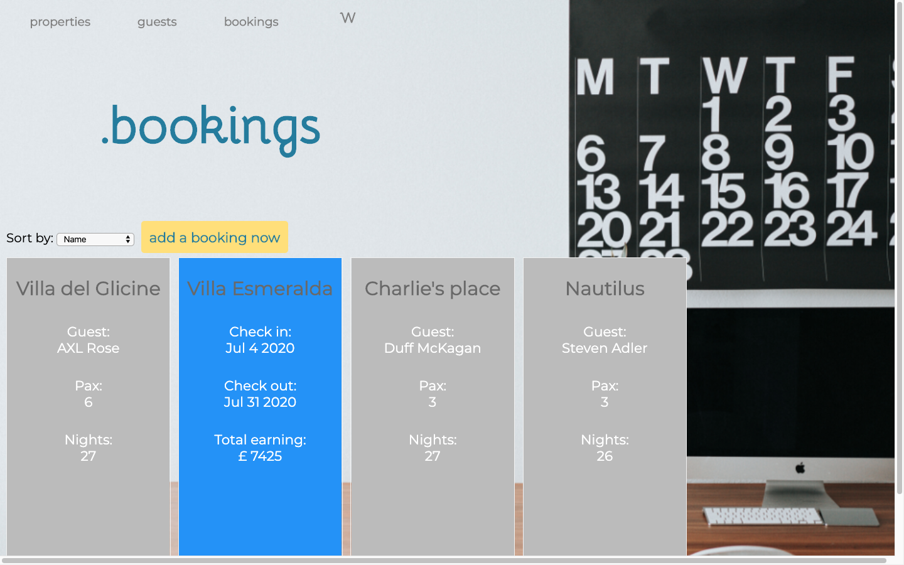

# Wiggo | Property management, organised.

Wiggo helps property managers to create, edit and visualise guests, properties and bookings from different booking platforms on one only tool.

## Features

The app allows the user to:
* View all the information about guests, properties and bookings organised respectively per last name, place and property name
* Show the guest booked in a property on the property card
* Show the property booked by a guest from the guest card
* Add new guests and properties
* Add bookings using existent guests and properties from the dropdown menu
* Edit and delete guests, properties and bookings
* Show the total earning a booking will provide

## Installing / Getting started

Git pull from https://github.com/saracastellino/week_5_ruby_project/tree/master/wiggo_property_management
Create a "wiggo" database
Run the wiggo_property_management/app.rb file
Run the wiggo_property_management/db/seeds.rb file
URL http://localhost:4567/

## Tech used

Ruby, SQL, Sinatra, HTML.

#### Code highlights

#### Styling

The colours used were adopted after researching protanopia to make text easily readable and aesthetically pleasant.

## Links

- Project homepage: https://github.com/saracastellino/week_5_ruby_project/tree/master/wiggo_property_management
- Repository: https://github.com/saracastellino/week_5_ruby_project

## Licensing

"The code in this project is licensed under SC license."
